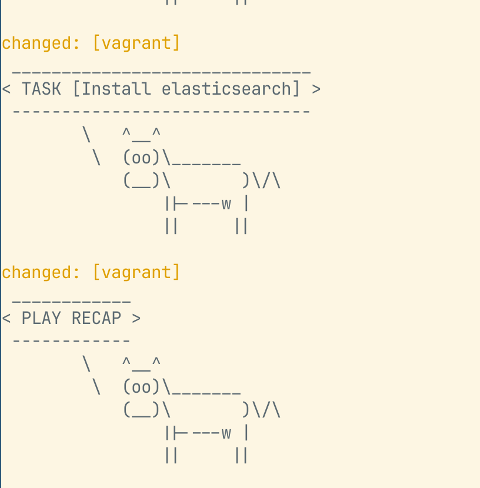
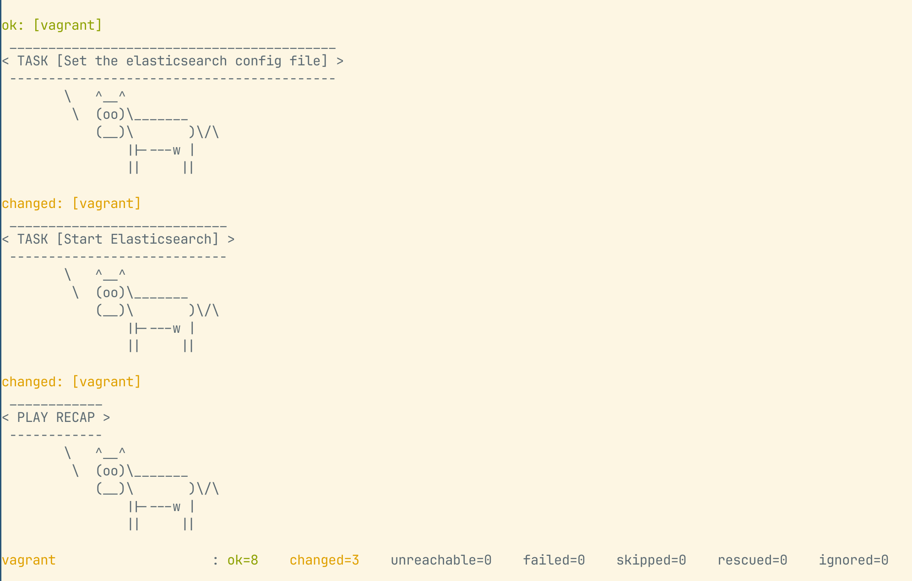

# Learn Ansible
## Step 1:
Deploy virtual machine with vagrant and libvirt
Write a file named Vagrantfile and run `vagrant up`
> Result:
```
Bringing machine 'vagrant1' up with 'libvirt' provider...
==> vagrant1: Creating shared folders metadata...
==> vagrant1: Starting domain.
==> vagrant1: Domain launching with graphics connection settings...
==> vagrant1:  -- Graphics Port:      5900
==> vagrant1:  -- Graphics IP:        127.0.0.1
==> vagrant1:  -- Graphics Password:  Not defined
==> vagrant1:  -- Graphics Websocket: 5700
==> vagrant1: Waiting for domain to get an IP address...
==> vagrant1: Waiting for machine to boot. This may take a few minutes...
    vagrant1: SSH address: 192.168.121.183:22
    vagrant1: SSH username: vagrant
    vagrant1: SSH auth method: private key
==> vagrant1: Machine booted and ready!
==> vagrant1: Forwarding ports...
==> vagrant1: 80 (guest) => 8080 (host) (adapter eth0)
==> vagrant1: 443 (guest) => 8443 (host) (adapter eth0)
==> vagrant1: Machine already provisioned. Run `vagrant provision` or use the `--provision`
==> vagrant1: flag to force provisioning. Provisioners marked to run always will still run.
```

## Step 2:
Check whether ansible can connect to vm or not.
```
ansible all -i inventory -m ping
```
> Result:
```
[WARNING]: Found both group and host with same name: vagrant
vagrant | SUCCESS => {
    "ansible_facts": {
        "discovered_interpreter_python": "/usr/bin/python3"
    },
    "changed": false,
    "ping": "pong"
}

```

## Step 3: Check whether install elasticsearch with ansible successful or not.

> Resutl:


## Step 4: Config elastic search.
> Result:


## Step 5: Do the same with kibana and check the result
- Run the command `ansible-playbook elk.yml`
> Result: 
```
tayto@taytaoto:~/Documents/ELKwithAnsible$ ansible-playbook elk.yml
[WARNING]: Found both group and host with same name: vagrant
 ___________________
< PLAY [Deploy elk] >
 -------------------
        \   ^__^
         \  (oo)\_______
            (__)\       )\/\
                ||----w |
                ||     ||

 ________________________
< TASK [Gathering Facts] >
 ------------------------
        \   ^__^
         \  (oo)\_______
            (__)\       )\/\
                ||----w |
                ||     ||

The authenticity of host '192.168.121.82 (192.168.121.82)' can't be established.
ED25519 key fingerprint is SHA256:/6f7x1VIAHTIx7nXacYYJZc8Txtfq+m2vOaHIImlJjs.
This key is not known by any other names.
Are you sure you want to continue connecting (yes/no/[fingerprint])? yes
ok: [vagrant]
 _______________________________
< TASK [Import elastic PGP key] >
 -------------------------------
        \   ^__^
         \  (oo)\_______
            (__)\       )\/\
                ||----w |
                ||     ||

changed: [vagrant]
 _________________________
< TASK [Install from apt] >
 -------------------------
        \   ^__^
         \  (oo)\_______
            (__)\       )\/\
                ||----w |
                ||     ||

changed: [vagrant]
 ________________________________________
< TASK [Save the repository definition.] >
 ----------------------------------------
        \   ^__^
         \  (oo)\_______
            (__)\       )\/\
                ||----w |
                ||     ||

changed: [vagrant]
 _________________________________________
< TASK [Install elasticsearch and kibana] >
 -----------------------------------------
        \   ^__^
         \  (oo)\_______
            (__)\       )\/\
                ||----w |
                ||     ||

changed: [vagrant]
 __________________________________________
< TASK [Set the elasticsearch config file] >
 ------------------------------------------
        \   ^__^
         \  (oo)\_______
            (__)\       )\/\
                ||----w |
                ||     ||

changed: [vagrant]
 ____________________________
< TASK [Start Elasticsearch] >
 ----------------------------
        \   ^__^
         \  (oo)\_______
            (__)\       )\/\
                ||----w |
                ||     ||

changed: [vagrant]
 __________________________________
< TASK [Generate enrollment token] >
 ----------------------------------
        \   ^__^
         \  (oo)\_______
            (__)\       )\/\
                ||----w |
                ||     ||

fatal: [vagrant]: FAILED! => {"changed": true, "cmd": ["/usr/share/elasticsearch/bin/elasticsearch-create-enrollment-token", "-s", "kibana"], "delta": "0:00:01.494982", "end": "2025-01-16 03:22:19.693878", "msg": "non-zero return code", "rc": 69, "start": "2025-01-16 03:22:18.198896", "stderr": "\nERROR: Failed to determine the health of the cluster. , with exit code 69", "stderr_lines": ["", "ERROR: Failed to determine the health of the cluster. , with exit code 69"], "stdout": "", "stdout_lines": []}
 ____________
< PLAY RECAP >
 ------------
        \   ^__^
         \  (oo)\_______
            (__)\       )\/\
                ||----w |
                ||     ||

vagrant                    : ok=7    changed=6    unreachable=0    failed=1    skipped=0    rescued=0    ignored=0
```


